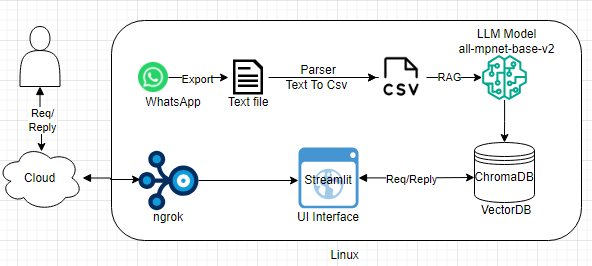

# WhatsApp Chat BOT
### Purpose
This is a ChatBot (Helper) designed to answer questions posted in on a WhatsApp group. The ChatBot understands your queries and provides the closest possible answers.

Example: Run below queries
- Google drive links
- Training Meeting Invite
- Baljeet contact details, please
- Recommended dev environment
- Quick_Chicken_Byte

### Environment
- Linux
- Python3
- ChromaDB
- ngrok

### Architecture

### How to run?
1. Export WhatsApp messages to text file
1. Run 'parser_querymate.py' which generates csv from text file
    ```Shell
    python parser_querymate.py
    ```
1. RAG csv data using 'producer_querymate.py' and store in ChromaDB
file
    ```Shell
    python producer_querymate.py
    ```
1. Run 'consumer_querymate.py' with sample quries
    ```Shell
    python consumer_querymate.py
    ```
1. Run 'ui_querymate.py' UI service on localhost to communicate with CromaDB
    ```Shell
    streamlit run ui_querymate.py
    ```
1. Run ngrok and expose UI interface to cloud
    ```Shell
    ngrok http http://localhost:8501
    ```
### Get sources from github
```text
git clone git@github.com:bhagavansprasad/QueryMate.git
```

### TODO
1. Image search
1. Replies are not upto the mark
1. Works on offline messages of WhatsApp
1. Optimization
1. User different LLMs to make the search better
1. Port it to [Hugging Interface](https://huggingface.co/)